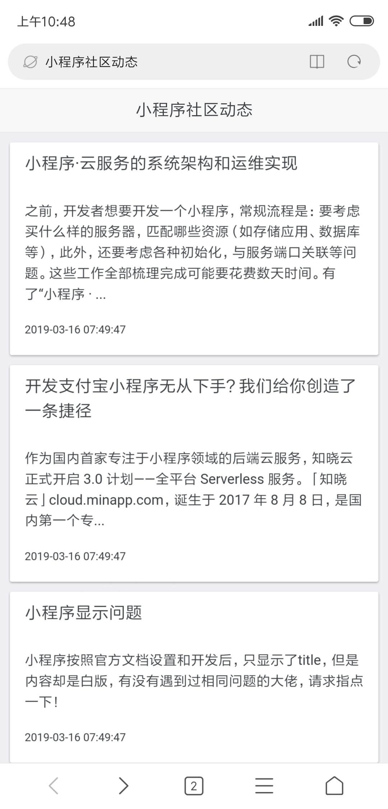

# MiniAppArticleSpider
MiniApp Article Spider

## 安装
```
# scrapy
pip install scrapy

# Flask
pip install Flask
```

## 运行
```
# 服务器启动
python app.py

# 爬虫启动
python main.py
```

## 效果



## 致谢
- [jinja2](http://docs.jinkan.org/docs/jinja2/)
- [flask](http://docs.jinkan.org/docs/flask/patterns/templateinheritance.html#template-inheritance)
- [SUI Mobile](http://m.sui.taobao.org/getting-started/)